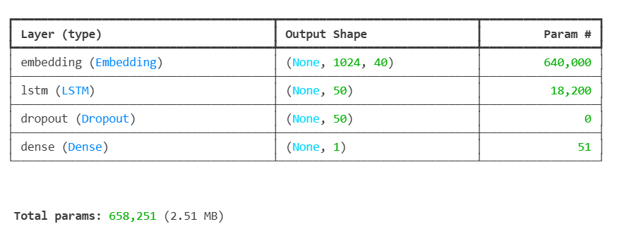
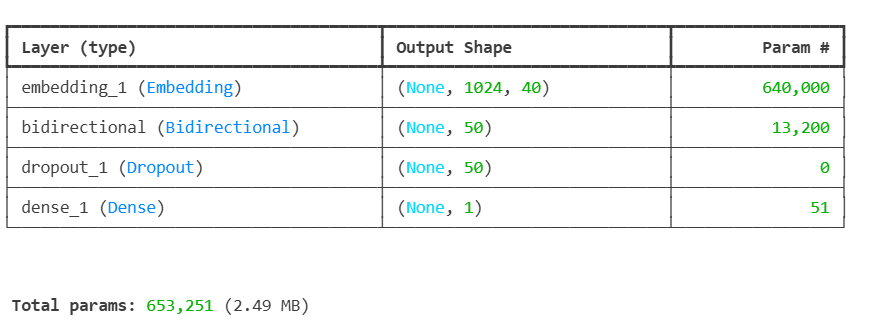
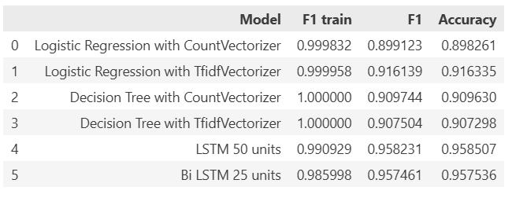

# fake-news-prediction
This project focuses on detecting fake news using a comprehensive data science pipeline. It includes exploratory data analysis (EDA), data cleaning, and the training of multiple machine learning (2 models) and deep learning (3 models) approaches to accurately classify news articles as real or fake.

- Datasets: Fake News (43642 records) and True News (34975 records)
- EDA:
  + Special Tokens Analysis
  + Text Length Distribution Analysis
  + WordCloud
  + N-gram Analysis
- Preprocessing:
  + Check and Drop Missing Values, Duplicates
  + Regex-based Text Processing
  + Lemmatization and Stopwords Removal
- Machine Learning:
  + Logistic Regression
  + Decision Tree
- Deep Learning:
  + LSTM 50 units
    
  + Bi LSTM 25 units
    
  + Longformer
- Reports:
  + 
